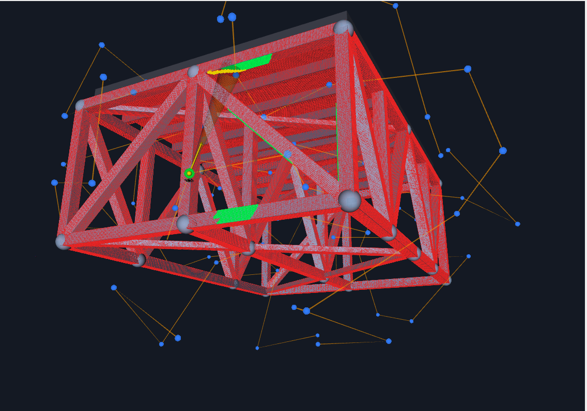
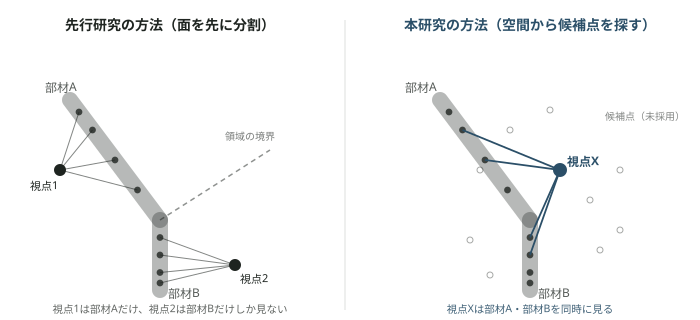

# Masanori Hashimoto

C++ / ROS2でロボティクスの経路計画アルゴリズムを実装するAIエンジニア志望。
名古屋工業大学大学院 打矢研究室 修士2年。

橋梁点検用ドローンの経路計画（Coverage Path Planning）を研究テーマにしている。

---

## プロジェクト実績：橋梁トラスUAV点検 経路計画（CPP）研究

**期間**：2026年〜継続中　**技術**：C++ / ROS2 / Gazebo　**範囲**：アルゴリズム設計〜シミュレーション検証

### 1. 社会的背景

国内の橋梁は建設後50年を超えるものが急増しており、2033年には全体の約63%に達すると推計されている。道路法は5年に1度、目視での近接点検を義務付けているが、点検員は不足し、高所・水上での近接目視作業には危険が伴う。自律ドローンによる自動点検が、この負担を軽減する解決策として期待されている。ドローンで構造物を漏れなく点検するには、撮影経路を自動生成する技術が必要になる。

### 2. トラス構造特有の課題

私は、橋梁点検の中でも特に撮影が困難になるトラス構造に着目した。トラス橋は多数の細長い部材が様々な角度で交差する構造を持ち、部材同士が密に接近するため安全に飛行できる空間は狭い。また、部材の背後や接合部周辺は特定の方向からしか撮影できない。

本研究では、この複雑な環境においても点検に必要な品質を満たしながら、構造物をできるだけ漏れなく撮影できる経路計画を検討している。

下の画像は、本研究で使用しているROS2/RViz上のシミュレーション画面である。赤色が部材の表面、灰色の球が複数の部材が集まる接合部、青い点と線が経路計画で使っている候補位置と経路を表している。

### 3. 先行研究とその取り入れ方

橋の点検で本当に重要なのは、ドローンがどれだけ効率よく飛べるかだけではなく、**撮った写真から実際にひび割れなどの変状を確認できるかどうか**である。

撮影の質を決める条件の一つが分解能である。カメラの画素数が同じでも、遠くから撮影するほど1ピクセルが担当する実物の範囲が広くなる。例えば1ピクセルが実物の1mmに対応していれば、0.5mm幅のひび割れは画像上で判別しにくい。逆に近づけば、1ピクセルが担当する範囲が小さくなり、細かいものまで見分けやすくなる。

本研究では、次の式から「1ピクセルが実物の何mmに対応するか」を計算し、要求値以下に収まっているかを判定している。

γ = arctan(α・β・L / (2f))
G(d,θ) = (d・L) / (f・H) × cosγ / (cos(θ+γ)・cosθ)

G(d,θ)が「1ピクセルが実物の何mmに対応するか」を表し、これが目標値（0.6mm/pixel）以下なら、その位置・角度からの撮影は要求される分解能を満たすと判定する。距離が遠いほど、また斜めから撮影するほど、1ピクセルが担当する範囲は大きくなる。

もう一つの条件がブレである。ドローンが動きながら撮影すると、シャッターが開いている間にカメラ自体が動き、画像がブレる。そのため本研究では、撮影時にドローンを静止させることを前提としている。

先行研究では、こうした分解能保証と静止撮影を満たしながら、対象となる面を分割して撮影視点を生成する方法が提案されている。本研究では、この考え方をトラス橋へ適用した。

### 4. 現状：工夫と結果

既存手法は、対象となる面を基準に撮影領域を分割し、それぞれを撮影する視点を生成する。

しかし、トラス橋のように複数の部材が交差する構造では、**接合部周辺で十分な被覆が得られないのではないか**と考えた。

そこで、接合部からの距離ごとに被覆率を比較した。その結果、既存手法では接合部に近い領域ほど被覆率が低下する傾向が確認できた。特に接合部から0〜1mの範囲では、被覆率が78.08%まで低下していた。

この結果から、**対象面を基準に視点を生成する方法では、接合部のような複雑な領域を十分にカバーできないのではないか**という仮説を立てた。

### 5. 提案手法：3D空間から視点候補を生成する
そこで私は、対象面から直接視点を生成するのではなく、**3D空間に候補点を配置し、その中から実際に多くの対象点を撮影できる位置を選択する方法**を提案した。

具体的には、橋梁表面上の対象点を橋全体で一つの集合として扱い、橋を取り囲む3D空間に1.5m間隔で格子状の候補点を生成する。

各候補点について、分解能・画角・遮蔽などの条件から実際に撮影できる対象点を求め、その中から、まだ撮影されていない対象点を最も多くカバーできる候補をGreedyに選択する。これを繰り返すことで視点集合を生成する。

この方法では、対象面を先に分割するのではなく、**どこから撮影すれば複数の部材を同時に見られるか**を3D空間全体から探索できる。

### 6. 結果

同じ橋梁モデル・対象点・被覆判定条件で、既存手法と提案手法を比較した。

| 手法 | 視点数 | ショット数 | 被覆率 |
|---|---:|---:|---:|
| 既存手法 | 582 | 3,358 | **93.25%** |
| **提案手法** | **270** | **7,239** | **97.68%** |

提案手法では、既存手法の93.25%に対して**97.68%まで被覆率が向上**した。

さらに接合部からの距離ごとに比較すると、0〜1mの領域では、

**78.08% → 100.00%**

まで改善した。

この結果から、対象面を基準に視点を生成するのではなく、**3D空間全体から候補視点を生成することで、特に接合部周辺のような複雑な領域の被覆を改善できる可能性**を確認した。

---

## AIツールとの向き合い方

研究の方針決定でAIエージェントを使うとき、効く使い方と効かない使い方がはっきり分かれると気づいた。判断基準は一つで、外部から情報が入るか、自分では見えない死角を突くかである。同じモデルに討論させるだけでは、もっともらしく見えても判断材料は増えない。効くと分かった使い方は4つ：

1. **反証タスク** — 擁護させず、成功/失敗が判定できる課題を渡す。「反証できなかった」という報告自体が情報になる。
2. **前提の掘り起こし** — 議論させず列挙させる。自分では見えない隠れた前提の網羅は、判断ではなく網羅なのでエージェント向き。
3. **隣接分野からの輸入** — 経路計画の外（非破壊検査・計測工学・写真測量規格など）を探させ、新しい定式化を持ち込む。
4. **制度・実務からの検証** — 難しさがアルゴリズムではなく、制度・運用側の要求から来ている可能性を潰す。

**実例（2026-08-20）**：「品質保証は視点数を増やせば力ずくで達成できる」という行き詰まりに直面したとき、エージェントに議論させる前に自分の実装を測った。視点85→227で被覆率は90.1%→98.2%に上がるのに、1枚あたりの達成分解能は0.456→0.458とほぼ不変で、増分は全て被覆率に使われ、品質保証には効いていなかった。さらに掘ると、被覆判定が機体の実座標ではなく計画上の視点座標で行われており、到達判定は0.4mのずれを許容していることが判明した。

---

## AIツールとの向き合い方

研究の方針決定や実装ではAIエージェントも活用している。ただし、AIに答えを出してもらうのではなく、**自分だけでは得られなかった情報を増やせるか**を基準に使っている。

特に有効だと感じている使い方は4つある。

1. **反証タスク** — 自分の仮説を擁護させず、成功・失敗を判定できる課題を与える。
2. **前提の掘り起こし** — 設計に含まれる前提条件を列挙させる。
3. **隣接分野からの輸入** — 経路計画以外の計測・検査・写真測量などから知見を探す。
4. **制度・実務からの検証** — 技術的な問題だと思っているものが、制度や運用上の要求から生じていないか確認する。

重要な判断は、まず自分の実装を測定し、その結果をもとに行う。AIには「もっともらしい答え」を求めるのではなく、**仮説を崩したり、自分では見落としていた前提を発見したりする役割**を持たせている。

---

## スキル

- **言語 / フレームワーク**：C++17, Python, ROS2 (rclcpp), CMake
- **アルゴリズム**：OBB衝突判定, レイキャスティング遮蔽判定, Greedy Set-Cover, SA-TSP, Voronoiクラスタリング
- **環境 / ツール**：Gazebo, Git, Linux (WSL2)

---

## Contact

- GitHub：*[プロフィールURLを追記]*
- 連絡先：*[メールアドレスを追記]*
