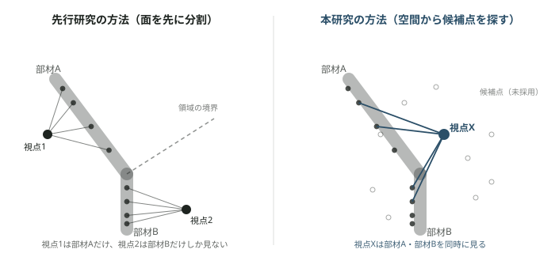

# Masanori Hashimoto

C++ / ROS2でロボティクスの経路計画アルゴリズムを実装するAIエンジニア志望。
名古屋工業大学大学院 打矢研究室 修士2年。

橋梁点検用ドローンの経路計画（Coverage Path Planning）を研究テーマにしている。既存研究の前提を鵜呑みにせず自分たちで測定し直し、必要なら設計を作り直すところまで踏み込む進め方をしている。

*[志望動機をここに1〜2文で追記]*

---

## プロジェクト実績：橋梁トラスUAV点検 経路計画（CPP）研究

**期間**：2026年〜継続中　**技術**：C++ / ROS2 / Gazebo　**範囲**：アルゴリズム設計〜シミュレーション検証

### 1. 社会的背景

国内の橋梁は建設後50年を超えるものが急増しており、2033年には全体の約63%に達すると推計されている。道路法は5年に1度、目視での近接点検を義務付けているが、点検員は不足し、高所・水上での近接目視作業には危険が伴う。自律ドローンによる自動点検が、この負担を軽減する解決策として期待されている。ドローンで構造物全面を漏れなく点検するには、撮影経路を自動生成する技術——**Coverage Path Planning（CPP、被覆経路計画）**——が要る。

### 2. トラス構造特有の課題

少なくとも岐阜県の運用基準では、トラス橋・アーチ橋・斜張橋・吊橋のような「構造が複雑な橋梁」は、UAV点検支援技術の適用対象から明示的に**除外**されている。除外理由は「構造が複雑」としか記されておらず、遮蔽が原因なのか、衝突リスクなのか、撮影品質の問題なのかは明文化されていない。トラス橋は多数の細長い部材が様々な角度で交差する構造を持ち、部材同士が密に接近するため安全に飛行できる空間は狭く、部材の背後や接合部の内側は特定の方向からしか撮影できない。本研究は、この「複雑さ」を追認せず、除外されている理由そのものに技術的に取り組む位置づけを取る。

### 3. 先行研究とその取り入れ方

橋の点検で本当に大事なのは、ドローンがどれだけ効率よく飛べるかではなく、**撮った写真から実際にひび割れが見つけられるかどうか**である。これは国や自治体の点検基準を読んでも一貫している——問われているのは移動の速さではなく、写真の質。

写真の質は、大きく2つの条件で決まる。

**1つ目は分解能。** 同じカメラでも、遠くから撮るほど、斜めから撮るほど、写真の中の1ピクセルが実物のどれくらいの大きさに対応するかは粗くなる。たとえば1ピクセルが実物の1mmに対応していれば、0.5mm幅のひび割れは写真では判別できない。本研究では、次の式で「1ピクセルが実物の何mmに対応するか」を計算し、要求される粗さ以下に収まっているかを確認している（先行研究〔羽田ら, 2025〕がT字型の橋脚を使った実験で確かめた式をそのまま使っている）。

```
γ = arctan(α・β・L / (2f))
G(d,θ) = (d・L) / (f・H) × cosγ / (cos(θ+γ)・cosθ)
```

記号の意味：`d`＝カメラから対象物までの距離、`θ`＝対象物の正面からどれだけ斜めに構えているかの角度、`f`＝カメラのレンズの焦点距離、`L`・`H`＝カメラのセンサーの大きさと解像度から決まる値。計算結果の`G(d,θ)`が「1ピクセルが実物の何mmに対応するか」で、これが目標値（例えば0.6mm）以下なら、その位置・その角度からの写真は診断に使える精度を満たしている、と判定する。**距離が遠いほど、角度が斜めなほど、`G`の値は大きく（＝粗く）なる。**

**2つ目はブレ。** ドローンが動きながら撮影すると、シャッターが開いている間にカメラ自体が動いてしまい、写真がブレる。これを避ける確実な方法は、撮影する瞬間だけドローンを完全に静止させることである。

先行研究（羽田ら, 2025）は、この2つの条件——分解能保証とブレ回避——を満たしながら、ドローンが止まる回数をできるだけ減らす方法を提案している。やり方はこうだ。まず橋の表面を、1回の停止で撮り切れる範囲ごとにいくつかの区画に分ける。次に、それぞれの区画の中心を向くようにカメラを構える位置を1つずつ決める。この方法で、動きながら撮り続ける従来のやり方に比べ、点検にかかる時間を47.7%短縮できたと報告されている。本研究は、この「分解能保証の式」と「静止して撮る」という2つの考え方を、そのまま土台として使っている。

ただし、この区画の分け方には見落としがある。下の図で説明する。



橋の部材Aと部材Bが、図のように交わっている場面を考えてほしい（実際のトラス橋では、こういう交わりが何箇所もある）。先行研究の方法（図左）は、部材Aの表面の点と部材Bの表面の点を「表面に沿った距離が近いかどうか」だけで別々の区画に分け、それぞれの区画の中心にカメラを1台ずつ置く（視点1・視点2）。この分け方は「実際にそのカメラの位置から見えるかどうか——途中に別の部材が入り込んで隠れていないか」を確認しないまま区画を決めている。もし部材Aと部材Bの両方を同時に見渡せる場所（図右の視点X）が実際にあっても、区画を先に決めてしまっているので、その場所を最初から候補に入れられない。

これがどれくらいの影響を持つのか、実際にこの橋を使って数えてみた。先行研究の方法で「この区画の中心からは、この範囲が見えているはずだ」と計算上見積もった範囲は、橋の表面全体の**91.9%**だった。ところが、実際に1点ずつ「本当にその位置からその点が見えているか（途中に別の部材が入り込んでいないか）」を数え直すと、**41.4%**しか見えていなかった。つまり、先行研究の計算が「見えている」と言っていた点のうち、半分以上は、実際には近くの別の部材に隠れていて写っていなかったことになる。先行研究の著者ら自身も、論文の中で「部材が密に交差するような構造では、この方法の効果は薄い」と認めている。今回の検証は、その効果の薄さが具体的にどれくらいの大きさかを、実際のトラス橋の形で数字にして確かめたことになる。

### 4. 現状：工夫と結果

そこで本研究では、確認する順番を逆にした（上の図の右側と同じ考え方）。先に表面を区画に分けるのではなく、まず3D空間のあちこちに「ここにカメラを置いたら何が見えるか」を試す候補地点をたくさん置く。そして、それぞれの候補地点について、実際にどの範囲が見えるかを——分解能の式を満たしているか、途中に別の部材が入り込んでいないか、カメラの画角に収まっているか、を1つずつ確認した上で——計算してから、最終的にどこにカメラを置くかを選ぶ。こうすると、部材Aと部材Bが交差している場所でも、その両方が同時に見える候補地点がもしあれば、それを自然に見つけられる。

以下は、この方法を実際にこの橋（部材53本のトラス構造）に当てはめて、コンピュータ上の幾何計算だけで確かめた結果である（Gazeboというシミュレータを使った、実機に近い状態での再現は現在進めている途中）。

- カメラを置ける候補地点をすべて試すと、**橋のどこかにドローンを225回止めてカメラを構えれば、橋の表面の98.2%を撮り終えられる**ことが分かった。ちなみに90%までなら85回の停止で足りていて、残り140回分は、最後にわずかに残った見落としを1つずつ拾い集めるために使われている。
- それでも、どうしても見えない点が353点だけ残った。共通する特徴を調べると、いずれも「複数の部材が四方から集まっている場所（接合部）のすぐそばにあり、部材同士に周りを囲まれていて決まった1方向からしか見えない面」だった。ドローンが部材にぶつからないための安全な距離を保ったままでは、その1方向にカメラを置く場所自体が存在しない——候補地点の数を増やしても解決しない、構造そのものによる限界である。
- 比較のために、前節で説明した先行研究の方法を同じ橋に当てはめると、計算上「見えている」ことになっていた91.9%に対し、実際に見えている範囲は41.4%だった（前節参照）。

この分解能保証の式（前節）は、実際にドローンを制御するプログラム（ROS2というロボット向けソフトウェアの上で動くコード）に組み込んで、動作を確認済みである。

---

## AIツールとの向き合い方

研究の方針決定でAIエージェントを使うとき、効く使い方と効かない使い方がはっきり分かれると気づいた。判断基準は一つ——外部から情報が入るか、自分では見えない死角を突くか。同じモデルに討論させるだけでは、もっともらしく見えても判断材料は増えない。効くと分かった使い方は4つ：

1. **反証タスク** — 擁護させず、成功/失敗が判定できる課題を渡す。「反証できなかった」という報告自体が情報になる。
2. **前提の掘り起こし** — 議論させず列挙させる。自分では見えない隠れた前提の網羅は、判断ではなく網羅なのでエージェント向き。
3. **隣接分野からの輸入** — 経路計画の外（非破壊検査・計測工学・写真測量規格など）を探させ、新しい定式化を持ち込む。
4. **制度・実務からの検証** — 難しさがアルゴリズムではなく、制度・運用側の要求から来ている可能性を潰す。

**実例（2026-08-20）**：「品質保証は視点数を増やせば力ずくで達成できる」という行き詰まりに直面したとき、エージェントに議論させる前に自分の実装を測った。視点85→227で被覆率は90.1%→98.2%に上がるのに、1枚あたりの達成分解能は0.456→0.458とほぼ不変——増分は全て被覆率に使われ、品質保証には効いていなかった。さらに掘ると、被覆判定が機体の実座標ではなく計画上の視点座標で行われており、到達判定は0.4mのずれを許容していることが判明した。

---

## スキル

- **言語 / フレームワーク**：C++17, Python, ROS2 (rclcpp), CMake
- **アルゴリズム**：OBB衝突判定, レイキャスティング遮蔽判定, Greedy Set-Cover, SA-TSP, Voronoiクラスタリング
- **環境 / ツール**：Gazebo, Git, Linux (WSL2)

---

## Contact

- GitHub：*[プロフィールURLを追記]*
- 連絡先：*[メールアドレスを追記]*
