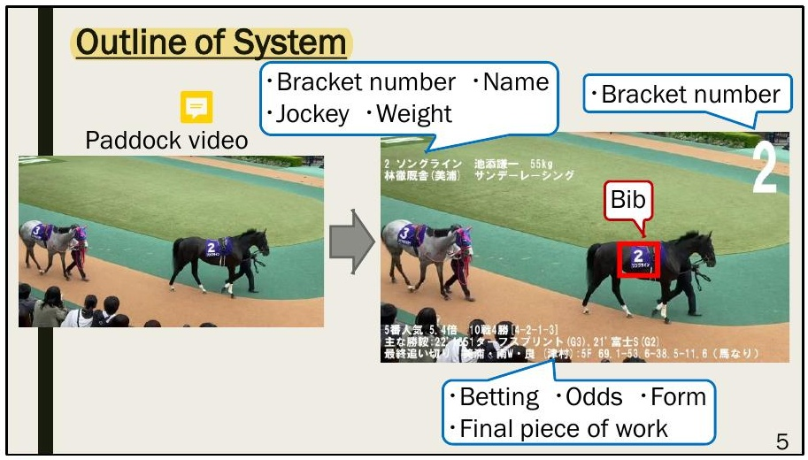
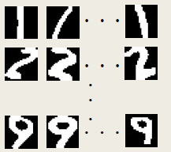
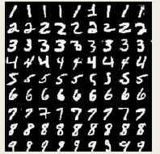

## プロジェクト実績：競走馬パドック動画からのゼッケン番号検知システム

**授業**：自由ワーク **技術**：画像処理（HSV色空間） / ニューラルネットワーク（教師あり学習） **範囲**：ゼッケン検出〜数字認識〜情報表示

### 課題

競馬の予想には、パドックでの馬の様子（歩様・毛づや・筋肉のつき方）の観察に加えて、新聞やスマホでの情報収集が欠かせない。パドックを見ながら同時に新聞を読み、スマホで検索するのは負担が大きく、パドックを見ながら情報を得られる方法が求められていた。

### システム概要

パドック動画の各フレームから、ゼッケン検出→数字抽出→ニューラルネットワークによる番号認識→競走馬データベース照会→情報表示、という5段階の処理を行うシステムを開発した。担当は画像処理・ニューラルネットワークによるゼッケン番号認識部分の実装。

### ゼッケンの検出と数字の抽出

ニューラルネットワークに画像全体をそのまま入力するのではなく、HSV色空間を用いた画像処理でゼッケンと数字の領域を先に絞り込んだ。入力画像から青色の領域が最大の部分をゼッケンとして検出し、そこから白色の領域が最大の部分を数字領域として抽出する。

### ニューラルネットワークの学習

手書き数字認識用データセットMNIST（60,000枚）に加えて、実際のパドック映像は背景・角度・明るさの条件が異なるため、パドック動画からゼッケン画像を収集し、回転・コントラスト調整・ノイズ付加・収縮（Erosion）によるData Augmentationで約2,000枚の訓練画像を作成し、これらを組み合わせて学習させた。

### 結果

実際のパドック動画に対してシステムを適用し、動画中の競走馬のゼッケン番号を認識できることを確認した。発表時の検証では、約90%の認識率を達成した。

